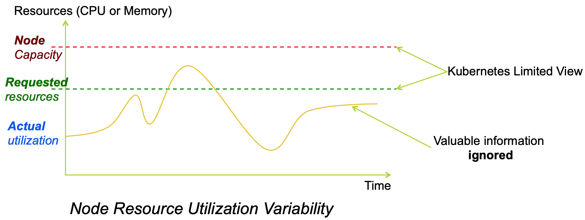
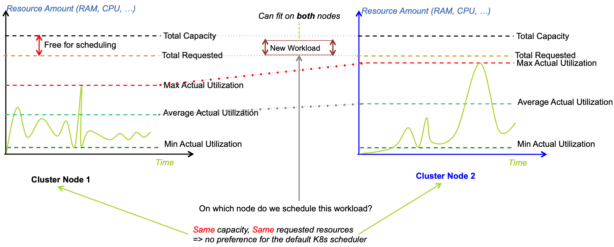

# kube-safe-scheduler

## Motivation

The Kubernetes `default scheduler` offers a lot of value in terms of the vast number of predicates and priorities it implements. Moreover, it is highly configurable, in the sense that we can change the default configuration to one that better matches our needs.



However, there is still room for improvement, and this improvement can be implemented in the form of extensions. For example, as shown in the figure above the default scheduler does not consider the actual utilization of resources of a given node to place a pod. I.e., if two nodes have a capacity of 8 CPUs, and only 5 are requested on each, then the two nodes will be deemed equivalent (assuming everything else is identical) for the default scheduler. However, we can extend to the priority algorithms to favor the node with less CPU actual utilization over a given period of time (e.g. last 6 hours).



Consider the example shown above, from the Kubernetes `default scheduler` perspective, both `Node_1` and `Node_2` are equally favorable for placing a new pod (e.g. requesting only CPU). However, by looking at historical data and the actual CPU utilization on the node, we can clearly see that we can be better performance for the new pod by placing it on `Node_1`. moreover this will further balance the CPU utilization accross the cluster nodes. 

The `Safe Scheduler` targets this issue, as well as having the ability to take risks on nodes with high requests but low actual utilization to maximize efficiency.

## Overview

Scheduler extension for Kubernetes, together with node annotator that collects statistics from Prometheus (or Metric server) to be used by the scheduling algorithm. The `Safe Scheduler` performs risk-aware (safe) allocation of resources, based on actual and predicted resource usage statistics of each node in the cluster, hence leading to safer placement of workload avoiding noisy neighbors, and reducing probability of evictions. It also can be configured to perform risk-aware over-commitment leading to better cluster utilization. The risk calculation minimizes the probability of exceeding the available resources, thus the name "Safe Scheduler".

We will use this project as incubator for new Kube scheduler extension ideas. One such idea brewing is to avoid nodes the pod is likely to fail on based on historical evidences.

## Description

This is an extender to a default Kubernetes scheduler which provides predicates and priority functions with the intent of making safe loading of the nodes. The word "safe" refers to not overloading the nodes and distributing the load, accounting for variability in resource usage, rather than just amount of allocated resources. This extended Kubernetes scheduler, referred to as SSX, uses historical resource usage data to schedule pods as opposed to relying on the specified pod requested demand. Overview and background information is [here](docs/usageResourceAlloc.pdf). The current version of SSX considers two resources: CPU and memory. It is based on the [Kubernetes secheduler example](https://github.com/everpeace/k8s-scheduler-extender-example).

A (separate) data collection component (example code in node-annotator directory) gathers node resource usage data  (through Prometheus, for example) and annotates the node with such information. For example, data about resource usage is given as follows.

```bash
Annotations:
		mean-free-memory=155597063
		std-free-memory=30372823
		mean-free-cpu=2500
		std-free-cpu=400
		
		forcasted-free-memory=200000000
		forcasted-free-cpu=2000
```

The average usage (mean) and standard deviation (std) quantities are calculated over a period of time. The units for memory and cpu are Bytes and MilliCPU, respectively. Based on the average and standard deviation values, a Beta distribution fit is computed to represent the distribution of resource utilization. Risk is calculated as the probability the utilization is above a given threshold value of utilization, e.g. 90 percent (default). The forecasted quantities are optional and are used to adjust the average values according to a specified forecasting weight.

SSX extends the predicates and priority functions of the default scheduler. It supports Kubernetes 1.13.5.

A predicate function 'safe-overload' accepts a node if the requested pod and the historical load on the node result in a risk that is less than a given percentile value, e.g. 30 percent (default). 

Two priority functions are provided: 'safe-overload' and 'safe-balance'. The former orders nodes based on their calculated risk values. The latter orders nodes according to a combined measure of average and standard deviation of the available resources. Such a combined measure allows a trade-off between the average load and the variability in the load. For example, a node with higher average load, but less variability, may be favored over one with less average load and high variability.

SSX may be configurable through the following environment variables: 

```
SAFEUTILIZATION			integer to set the threshold utilization value
SAFEPERCENTILE			integer to set the percentile acceptable value
SAFEFORECASTWEIGHT	integer to set weight percentage of forecast value
SAFEPRINTTABLE			boolean to select detailed logging information
```

An example follows.

```
env:
          - name: SAFEUTILIZATION
            value: "90"
          - name: SAFEPERCENTILE
            value: "30"
          - name: SAFEFORECASTWEIGHT
            value: "20"
          - name: SAFEPRINTTABLE
            value: "false"
```

Samples of deployment yaml files for the `Safe Scheduler` Extender and pods are provided. The scheduler deployment file deploys a pod with two containers: a default scheduler (named my-scheduler) and the SSX extender. The desired predicates and priority functions to be applied in a given deployment are specified in the ConfigMap specifications. A pod uses the `Safe Scheduler` by asking for the scheduler by name (my-scheduler) as in the [pod creation example](test-pod.yaml). A [deployment example](extender.yaml) and [output example](docs/example.pdf) are provided.

#### Extending the Extender: An example

It is rather straightforward to add predicates and priority functions to this Scheduler Extender. An example of a priority function called *'congestion'* is provided in [congestion](congestion.go). This assumes that a node is annotated with a value representing a form of congestion on the node. This may be due to measured load on the node and/or networking congestion in and out of the node. The key for the annotation is *'congestion-factor'* and the value is an integer between zero and 100 (or another maximum value provided by the environment variable 'CONGESTION_FACTOR_MAX'). The higher the value the more congestion there is on the node. A missing congestion value means zero congestion. The intent of this priority function is to have the scheduler prefer nodes with low congestion values. In order to activate the *'congestion'* priority function, one needs to add in the [extender](extender.yaml) deployment file:

`"prioritizeVerb": "priorities/congestion",`

 the  to the *ConfigMap policy.cfg* definition, under *"extenders"*.


## Instructions

### 1. buid a docker image

```
$ docker build . -t kube-safe-scheduler:1.13.5
```

### 2. deploy `my-scheduler` in `kube-system` namespace
```
$ kubectl create -f extender.yaml
```

### 3. schedule test pod
```
$ kubectl create -f test-pod.yaml

$ kubectl describe test-pod
Name:         test-pod
...
Events:
  Type    Reason     Age   From                   Message
  ----    ------     ----  ----                   -------
  Normal  Scheduled  42s   my-scheduler           Successfully assigned default/test-pod to worker-node1
  Normal  Pulling    41s   kubelet, worker-node1  pulling image "nginx"
  Normal  Pulled     41s   kubelet, worker-node1  Successfully pulled image "nginx"
  Normal  Created    41s   kubelet, worker-node1  Created container
  Normal  Started    40s   kubelet, worker-node1  Started container
```


### 4. inspect logs

```
kubectl logs -f <my-scheduler-...>  -c my-kube-safe-scheduler-ctr -n kube-system
```


